# 📨 Smart Email Writer Backend (Spring Boot + Gemini AI)

This is the **Spring Boot backend** for the **Email Writer Application**, an AI-powered tool that generates professional and context-aware email replies using **Google Gemini API**.  
It receives email content and tone preferences from the frontend or browser extension, then crafts an intelligent response with the specified tone.

---

## 🚀 Features

✅ RESTful API built with Spring Boot  
✅ AI-generated email replies using **Gemini API**  
✅ Reactive non-blocking HTTP requests with **Spring WebClient**  
✅ Modular structure with DTOs, services, and controllers  
✅ Cross-Origin (CORS) enabled for frontend & extension integration  

---

## 🧠 How It Works

1. The user sends an email content and tone (e.g., formal, polite, friendly).  
2. The backend constructs a custom **prompt** for Gemini API.  
3. It sends the prompt using **WebClient** in JSON format.  
4. The Gemini API responds with an AI-generated email reply.  
5. The backend extracts and returns this reply to the frontend/extension.

---

## ⚙️ Tech Stack

| Layer | Technology |
|-------|-------------|
| Backend Framework | Spring Boot |
| HTTP Client | Spring WebClient |
| JSON Parser | Jackson (ObjectMapper) |
| API | Google Gemini API |
| Build Tool | Maven |
| Language | Java 17+ |


---

## 🧩 API Endpoint

### **POST** `/api/email/generate`

**Description:**  
Generates an AI-based email reply using Gemini API.

**Request Body:**
```json
{
  "emailContent": "Hey, can you share the project report by tomorrow?",
  "tone": "formal"
}
```

## 🔐 Environment Variables

"You’ll need to configure your Gemini API details in the application.properties file:"
```json
gemini.api.url=https://generativelanguage.googleapis.com/v1beta/models/gemini-pro:generateContent?key=
gemini.api.key=YOUR_GEMINI_API_KEY
server.port=808
```

## 🧩 API Flow Diagram
"Here’s how the complete data flow works between the browser extension / frontend, backend, and Gemini AI 👇"

```mermaid
sequenceDiagram
    participant User as 🧑‍💻 User (Gmail/Frontend)
    participant Ext as 🔌 Chrome Extension
    participant API as ☕ Spring Boot Backend
    participant Gemini as 🤖 Gemini API

    User->>Ext: Clicks "AI Reply" button
    Ext->>API: POST /api/email/generate<br/>{"emailContent", "tone"}
    API->>API: Build prompt & format request JSON
    API->>Gemini: POST Gemini API Request (via WebClient)
    Gemini-->>API: Returns AI-generated reply text
    API-->>Ext: Sends generated email reply
    Ext-->>User: Inserts reply into Gmail compose bo
```



